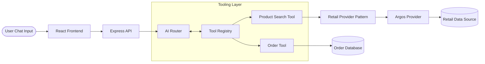

<div align="center">

# 🛍️ Retail AI Platform


*A scalable, highly intelligent Retail AI Assistant powered by Google Gemini and OpenRouter. Designed with a modular Provider Architecture to seamlessly integrate with any global retailer.*

<p align="center">
  
  
  
  
  
  
  
  
</p>

</div>

---

## 📑 Table of Contents

- [About the Project](#-about-the-project)
- [Future Vision](#-future-vision)
- [Features](#-features)
- [Architecture](#-architecture)
- [Project Structure](#-project-structure)
- [Screenshots](#-screenshots)
- [Current Demo](#-current-demo)
- [Roadmap](#-roadmap)
- [Tech Stack](#-tech-stack)
- [Installation](#-installation)
- [Contributing](#-contributing)
- [License](#-license)
- [Contact](#-contact)

---

## 📖 About the Project

The **Retail AI Platform** is a cutting-edge, scalable AI assistant tailored for the e-commerce and retail sector. Traditional chatbots are rigid and hardcoded; this project leverages large language models (LLMs) via **OpenRouter** and **Google Gemini** to create a dynamic, conversational shopping assistant that actually understands user intent.

At the core of the platform is a robust **Provider Architecture** and an **AI Tool Registry**. This design allows the AI to intelligently decide which backend tools (e.g., Product Search, Order Tracking) to execute based on the conversation context. The platform is built to support multiple retailers out-of-the-box, with **Argos** currently implemented as the first supported retailer.

## 🔭 Future Vision

The long-term goal of the Retail AI Platform is to become a universal, plug-and-play AI solution that can be instantly integrated into any major retailer (e.g., *Argos, Currys, IKEA, Tesco, Walmart*). By leveraging the Provider pattern, new retailers can be onboarded simply by implementing a standard data provider, completely abstracting the complex AI routing and conversational logic from the underlying business data.

---

## ✨ Features

Here is everything implemented in the platform so far:

- ✅ **AI Shopping Assistant:** Intelligently asks follow-up questions for vague requests.
- ✅ **AI Tool Registry:** Dynamically registers and routes tools for the LLM to execute.
- ✅ **Modular Provider Pattern:** Highly scalable architecture for multi-retailer support.
- ✅ **Product Search:** Live product querying with intelligent context matching.
- ✅ **Product Search Tool:** Dedicated tool for the AI to query catalog data.
- ✅ **Order Tracking:** Real-time tracking for specific order numbers.
- ✅ **Order History:** Retrieves past purchases for authenticated customers.
- ✅ **Conversation Memory:** Context-aware chat that remembers earlier messages.
- ✅ **React Frontend:** Fast, modern, and highly responsive user interface.
- ✅ **Express Backend:** Secure and robust API layer.
- ✅ **OpenRouter + Gemini Integration:** State-of-the-art LLM capabilities.
- ✅ **Responsive Chat UI:** Beautifully crafted with Tailwind CSS.
- ✅ **Beautiful Product Cards:** Renders search results visually with fetched images.
- ✅ **Typing Indicator:** Animated bouncy dots while the AI is "thinking".
- ✅ **Auto Scroll:** Automatically tracks the latest messages.
- ✅ **Local Chat History:** Persists chat sessions across reloads.
- ✅ **Message Timestamps:** Accurate time tracking for all chat nodes.
- ✅ **Reusable Components:** Clean, maintainable React architecture.

---

## 🏗️ Architecture

The platform utilizes an LLM-driven Tool Registry. The frontend communicates with the Express backend, where the AI Router intercepts the message, identifies the intent, and dynamically executes registered tools.



---

## 📂 Project Structure

<details>
<summary>Click to expand</summary>

```text
retail-ai-platform/
├── frontend/                     # React + Vite UI
│   ├── src/
│   │   ├── components/           # Reusable UI components (ChatWindow, ProductCard)
│   │   ├── types/                # TypeScript interfaces
│   │   ├── App.tsx               # Main application view
│   │   └── index.css             # Tailwind styling
│   ├── package.json
│   └── vite.config.ts
│
├── backend/                      # Node.js + Express API
│   ├── src/
│   │   ├── config/               # Environment and Prompts
│   │   ├── controllers/          # Route handlers
│   │   ├── middleware/           # Error handling & CORS
│   │   ├── providers/            # Retailer integrations (ArgosProvider)
│   │   ├── services/             # Core logic (LLM, OrderService)
│   │   ├── tools/                # AI Tools (ToolRegistry, ProductSearchTool)
│   │   ├── types/                # TypeScript interfaces
│   │   └── server.ts             # Express entry point
│   └── package.json
│
└── README.md
```
</details>

---

## 📸 Screenshots

*(Images coming soon)*

| Home Dashboard | Product Search |
| :---: | :---: |
|  |  |

| Order Tracking | Conversational UI |
| :---: | :---: |
|  |  |

---

## 🚀 Current Demo

What can users currently do in the application?
- **Search Products:** *"I need a Samsung phone"* or *"Show me some laptops"*
- **Receive Visual Recommendations:** The AI will display beautiful, hydrated product cards.
- **Track Orders:** *"Where is order ORD-010?"*
- **View Previous Orders:** *"What did I buy last month?"*
- **Ask Shopping Questions:** Have natural conversations about product features.
- **Guided Shopping:** If a user is vague (*"I need a printer"*), the AI asks follow-up questions to refine the search.

---

## 🗺️ Roadmap

### Completed
- [x] AI Router
- [x] Tool Registry
- [x] Shopping Assistant
- [x] Order Tool
- [x] Product Search
- [x] Beautiful UI Product Cards

### Planned
- [ ] Store Availability Tool
- [ ] Product Comparison
- [ ] Voice Shopping
- [ ] Multi Retail Support (Currys, Tesco)
- [ ] Authentication Integration
- [ ] Real Retail APIs Hookup
- [ ] Admin Dashboard

---

## 💻 Tech Stack

| Layer | Technology |
|---|---|
| **Frontend** | React 19, Vite, TypeScript |
| **Backend** | Node.js, Express, TypeScript |
| **AI / LLM** | Google Gemini (via OpenRouter API) |
| **Styling** | Tailwind CSS v4 |
| **Development** | Nodemon, Oxlint |

---

## 🛠️ Installation

Follow these steps to run the platform locally on your machine.

### 1. Clone the repository
```bash
git clone https://github.com/yourusername/retail-ai-platform.git
cd retail-ai-platform
```

### 2. Environment Variables
Create a `.env` file in the `backend/` directory:
```env
PORT=3001
OPENROUTER_API_KEY=your_openrouter_api_key_here
```

### 3. Install & Run Backend
```bash
cd backend
npm install
npm run dev
```
*The backend will start on `http://localhost:3001`.*

### 4. Install & Run Frontend
Open a new terminal window:
```bash
cd frontend
npm install
npm run dev
```
*The frontend will start on `http://localhost:5173`.*

---

## 🤝 Contributing

Contributions are what make the open-source community such an amazing place to learn, inspire, and create. Any contributions you make are **greatly appreciated**.

1. Fork the Project
2. Create your Feature Branch (`git checkout -b feature/AmazingFeature`)
3. Commit your Changes (`git commit -m 'Add some AmazingFeature'`)
4. Push to the Branch (`git push origin feature/AmazingFeature`)
5. Open a Pull Request

---

## 📄 License

Distributed under the MIT License. See `LICENSE` for more information.

---

## 📫 Contact

**Chandra Kiran** - [LinkedIn](https://www.linkedin.com/in/chandra-kiran-malkapuram/)

Project Link: [https://github.com/yourusername/retail-ai-platform](https://github.com/chandrakiranmalkapuram/retail-ai-assistant)

<div align="center">
  <i>If you found this project helpful, please consider giving it a ⭐ on GitHub!</i>
</div>
